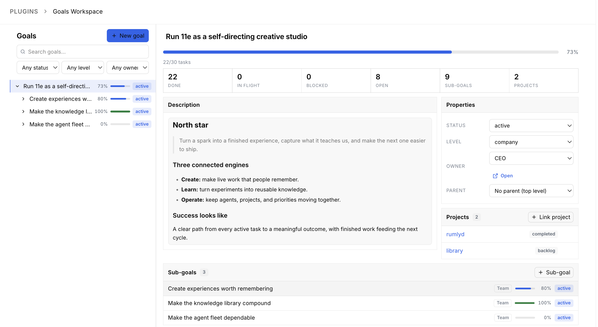

# Goals Workspace — a Paperclip plugin

Paperclip's Goals page shows you a tree. This turns it into a place you can actually work.

Everything the `paperclipai goal` CLI can do — reassign an owner, reparent, delete, link
projects, link tasks — plus the two things neither surface had: **progress rolled up
through the tree**, and **a delete that does not throw a database error at you**.



## What it adds

| | Paperclip today | With this plugin |
|---|---|---|
| Change a goal's **owner** | read-only field | agent picker, writes through |
| **Delete** a goal | not possible in the UI | impact scan → detach → delete |
| **Reparent** a goal | read-only link | picker, with cycle prevention |
| Link / unlink **projects** | read-only list | multi-select link, one-click unlink |
| Link / unlink **tasks** | no issue surface at all | searchable picker, unlink inline |
| **Progress** | nowhere | bar + percent + done/total on every node |
| **Relationships** | two tabs | owner, parent chain, sub-goals, projects and tasks in one view |
| **Finding a goal** | scroll the tree | search + status / level / owner filters |
| A task's goal | invisible | a **Goal** tab on every issue |
| A project's goals | invisible | a **Goals** tab on every project |

## Surfaces

- **Goals** in the left sidebar → the full workspace at `/:company/goals-workspace`
- **Goal** tab on any issue — see and change which goal a task rolls up into
- **Goals** tab on any project — link and unlink the project's goals

## How progress is calculated

A goal's tasks are the issues pointed straight at it (`issues.goalId`) **plus** the issues of
every project linked to it, unioned with the same set for each descendant. The union is by
issue id, so an issue that is both directly linked and inside a linked project is counted
once, and an issue under both a goal and its parent is counted once at the parent.

- **Cancelled issues leave the denominator.** Cancelling work should not make a goal look
  further behind than before.
- **A goal with no tasks falls back to sub-goal completion**, so a purely strategic goal
  still reads as making progress. The readout says which basis it used.
- **A goal with neither shows no percentage** rather than a misleading 0%.

## Deleting a goal

Paperclip's delete endpoint is a bare `DELETE FROM goals`, and every inbound foreign key on
that table is `ON DELETE no action` — `goals.parent_id`, `issues.goal_id`,
`projects.goal_id`, `cost_events.goal_id`, `finance_events.goal_id`. Only the
`project_goals` join table cascades. A plain Delete button would therefore throw a raw
Postgres constraint error on any goal that has a child, a linked task, or a project holding
the legacy column — which is most real goals.

So this plugin scans first and tells you exactly what is attached:

- sub-goals are **lifted to the deleted goal's own parent**, not orphaned to top level
- linked tasks keep existing, they just lose the goal link
- linked projects are unlinked

then deletes. Cost and finance events cannot be detached through any API; if one of those
holds a reference the plugin reports the block instead of pretending.

## Clearing a task's goal does not always clear it

`PATCH /api/issues/:id {goalId: null}` does not simply null the column. The host runs
`resolveNextIssueGoalId` on every issue update, and it **branches on whether the task has a
project at all**:

| The task | Clearing its goal yields |
|---|---|
| belongs to a project | that project's legacy `projects.goal_id`, or **nothing** if it is unset |
| belongs to no project | the **company default goal** — the oldest active top-level `company` goal |

The branch does not fall through: a task inside a project never reaches the company
default. And the project side reads the legacy single-goal column only — never the
`project_goals` join table — so a project linked purely through the many-to-many array
contributes nothing here. Both halves verified against a live instance.

Three things follow, and the plugin does all three:

- **The clear option tells you the truth for *that* task.** It is labelled `Clear (falls
  back to “…”)` only when the task has no project, and plainly `No goal` when clearing
  would really clear.
- **The write is read back.** If the host lands the task somewhere you did not ask for, the
  toast names the goal it actually went to rather than claiming an unlink that did not
  happen.
- **Deleting a goal reassigns its tasks rather than clearing them.** A cleared goal can be
  re-derived straight back to the goal being deleted, so the foreign key would still block,
  *after* the other detach writes had already run. Tasks move to the deleted goal's parent,
  or to the surviving company default. If a goal has tasks and is the only goal in the
  company, the delete is refused up front with an explanation.

## Install

In the Paperclip UI:

1. Open **Settings → Plugins** and click **Install Plugin**.
2. Enter **`paperclip-goals-workspace`** and submit. This is the npm package name,
   which matches this repository's name; a GitHub URL is not needed.
3. Once the plugin is ready, open a company and select **Goals** in its sidebar.

Installing plugins requires instance admin access.

Or use the CLI:

```bash
paperclipai plugin install paperclip-goals-workspace
```

Use the unversioned package name to install the latest published release.
Paperclip currently looks for a literal directory named
`paperclip-goals-workspace@<version>` after an npm install with `@<version>`,
although npm creates `node_modules/paperclip-goals-workspace`. This produces
"Package directory not found after installation". The unversioned name
above installs the latest release.

Or install from a checkout:

```bash
bun install && bun run build
paperclipai plugin install /path/to/paperclip-goals-workspace
```

> **Upgrading, and the capability trap.** Paperclip's plugin loader diffs capabilities on
> upgrade and **throws on any addition** — after it has already unloaded the running
> worker, which leaves the plugin installed with no worker at all. This plugin's capability
> set is frozen for that reason. If a future version ever does add one, upgrade with
> `plugin uninstall <key>` (**without** `--force`, which would purge state) followed by
> `plugin install`, never `plugin upgrade`.

## Architecture

Deliberately one write path.

- **The worker is a read model.** It joins goals, projects, issues and agents into one
  rollup so the browser receives a few kilobytes of counts instead of the company's whole
  issue table. Capabilities: `goals.read`, `projects.read`, `issues.read`, `agents.read`,
  plus `events.subscribe` to push a refresh when an agent changes a goal.
- **Every mutation goes over the host REST API** from the UI bundle — the same five
  endpoints the `goal`, `project` and `issue` CLI commands use. This is partly forced:
  the plugin SDK's `ctx.goals` has no `delete` and `ctx.projects` has no `update`, so goal
  deletion and project linking could not be worker-side. Splitting writes across two
  transports would leave two sources of truth for the same row.
- **No slot is declared that the host does not mount.** The SDK lists `goal`, `agent` and
  `run` as `detailTab` entity types, but the host UI only queries `detailTab` slots for
  `issue`, `project`, `execution_workspace` and `project_workspace`. A goal detail tab
  would be accepted, stored, and silently never rendered — so there isn't one.

## Development

```bash
bun install
bun run build       # dist/worker.js, dist/manifest.js, dist/ui/index.js
bun run typecheck
bun test            # pure model + route logic
```

The rollup, filtering, cycle guard, delete-impact and detach-plan logic all live in
`src/model.ts` — no React, no SDK, no I/O — so the arithmetic behind every progress bar is
unit-testable without a browser.

## Compatibility

Built and verified against Paperclip `2026.824.1` and `@paperclipai/plugin-sdk`
`2026.824.1`.

## License

MIT
